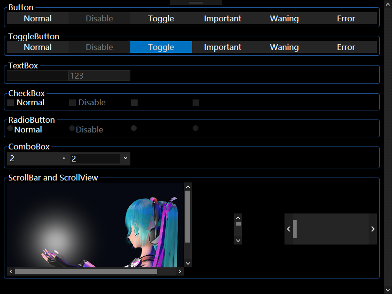

# MiRaIUIProject

This project is a WPF UI Resouse Library.

all of the template use brush only base on a group of brush with special name, and you can change the color only by change the brush rather than rewrite the template.



I have finish work of button, togglebutton, textbox, checkbox, radiobutton, scrollbar and scrollview, and the style of checkbox is not wanderful.


# about the brush style:
the name is like "Brush_Control_BG_Normal_Normal"

## Brush : the resouse type
and if the resouse is a style, the name should begin with "Style"

## Control : the object type.
there are "**Panel**"(used on **Panel** like **ScrollView** and **GroupBox**) and "**TextBox**"(I think we should let **textbox** differently to keep our eyes more comfortabe) selectable

## BG : Properties, BG is background color
there are "**FG**"(foreground) and "**Border**" available
## Normal : the state.
there exist "**Disable**", "**Toggle**"(the second state), ~~"**Imp**"(important, optional)~~, ~~"**Warning**"(optional)~~, ~~"**Error**"(optional)~~ selectable

## Normal : UI state
there are "**PointIn**"(mousein), "**FocusOn**"(**FocusOn**, but now we use **FocusVisualStyle** to replace **FocusOn** style usually), "**PandF**"(Point in with focus on), "**Pressed**"(it only available when the type is **Control**) selectable

## summary
### Control
<table>
<tr>
	<td rowspan="3">Property</td>
	<td>BG</td>
</tr>
<tr> <td>FG</td> </tr>
<tr> <td>Border</td> </tr>
<tr>
	<td rowspan="6">State</td>
	<td>Normal</td>
</tr>
<tr> <td>Disable</td> </tr>
<tr> <td>Toggle</td> </tr>
<tr> <td><s>Imp</s></td> </tr>
<tr> <td><s>Warning</s></td> </tr>
<tr> <td><s>Error</s></td> </tr>

<tr>
	<td rowspan="5">UX State</td>
	<td>Normal</td>
</tr>
<tr> <td>PointIn</td> </tr>
<tr> <td>FocusOn</td> </tr>
<tr> <td>PandF</td> </tr>
<tr> <td>Pressed</td> </tr>

</table>

### Panel
<table>

<tr>
	<td rowspan="3">Property</td>
	<td>BG</td>
</tr>
<tr> <td>FG</td> </tr>
<tr> <td>Border</td> </tr>
<tr>
	<td rowspan="6">State</td>
	<td>Normal</td>
</tr>
<tr> <td>Disable</td> </tr>
<tr> <td>Toggle</td> </tr>
<tr> <td><s>Imp</s></td> </tr>
<tr> <td><s>Warning</s></td> </tr>
<tr> <td><s>Error</s></td> </tr>

<tr>
	<td rowspan="4">UX State</td>
	<td>Normal</td>
</tr>
<tr> <td>PointIn</td> </tr>
<tr> <td>FocusOn</td> </tr>
<tr> <td>PandF</td> </tr>
</table>

### TextBox
<table>
<tr>
	<td rowspan="3">Property</td>
	<td>BG</td>
</tr>
<tr> <td>FG</td> </tr>
<tr> <td>Border</td> </tr>
<tr>
	<td rowspan="6">State</td>
	<td>Normal</td>
</tr>
<tr> <td>Disable</td> </tr>
<tr> <td>Toggle</td> </tr>
<tr> <td><s>Imp</s></td> </tr>
<tr> <td><s>Warning</s></td> </tr>
<tr> <td><s>Error</s></td> </tr>

<tr>
	<td rowspan="4">UX State</td>
	<td>Normal</td>
</tr>
<tr> <td>PointIn</td> </tr>
<tr> <td>FocusOn</td> </tr>
<tr> <td>PandF</td> </tr>
</table>

# How to use the library
1. **Import the theme file, like "Dark.xaml"**. This file declare all of the brush and "**StyleFocusVisual**"

2. **Import template files which you need**. 

3. use resouse files in your project. If you need to use multiple resouse files, you need use "<ResourceDictionary.MergedDictionaries>" like my project.
``` xml
<ResourceDictionary>
	<ResourceDictionary.MergedDictionaries>
		<ResourceDictionary Source="Theme\Dark.xaml"/>
		<ResourceDictionary Source="ControlTemplate\Button.xaml"/>
		<ResourceDictionary Source="ControlTemplate\GroupBox.xaml"/>
		<ResourceDictionary Source="ControlTemplate\TextBox.xaml"/>
		<ResourceDictionary Source="ControlTemplate\ToggleButton.xaml"/>
		<ResourceDictionary Source="ControlTemplate\CheckBox.xaml"/>
		<ResourceDictionary Source="ControlTemplate\ScrollBar.xaml"/>
		<ResourceDictionary Source="ControlTemplate\ScrollView.xaml"/>
		<ResourceDictionary Source="ControlTemplate\RadioButton.xaml"/>
		<ResourceDictionary Source="ControlTemplate\ComboBox.xaml"/>
	</ResourceDictionary.MergedDictionaries>
</ResourceDictionary>
```